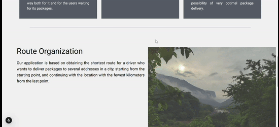
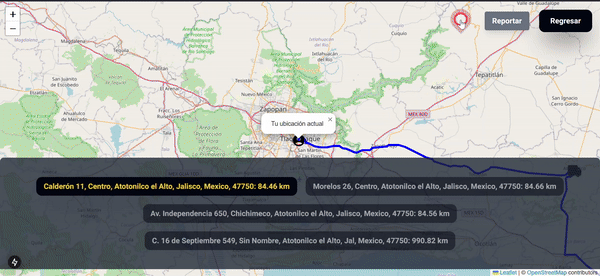
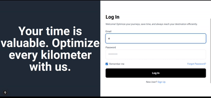
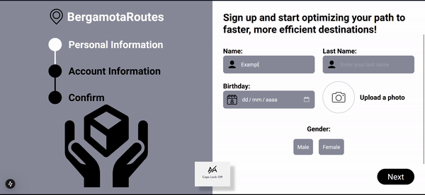
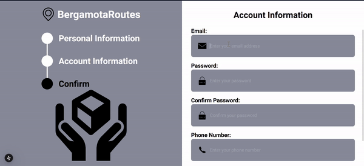
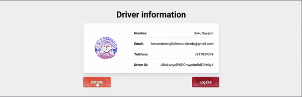

🚚 BergamotaRoutes
BergamotaRoutes is a powerful platform for route optimization and real-time tracking, designed to make logistics smarter and more efficient.

🚀 Smart Route Optimization
Save time and resources with our advanced route planning tools. Generate optimized routes in seconds, minimizing distances and operational costs.

🔐 Login to BergamotaRoutes
The BergamotaRoutes Login System is your gateway to smarter logistics and seamless route management. Designed with ease of use and security in mind, it ensures quick and secure access to your personalized dashboard

📝 Register for BergamotaRoutes
Get started with BergamotaRoutes by creating your account. Our registration process is quick, easy, and secure, giving you immediate access to the tools you need for route optimization and real-time tracking.

Start your journey with BergamotaRoutes today by registering and revolutionize the way you manage your logistics and routes!

🔑 Enter Your Route Code and Preview Your Route
With BergamotaRoutes, planning and visualizing your delivery routes is easier than ever. Simply enter your route code and get an instant preview of your optimized route, giving you a clear view of your journey before hitting the road.

🌟 Key Features
Instant Route Preview
Enter your route code to quickly generate and preview your optimized route on an interactive map.

Real-Time Updates
Once you enter the route code, see up-to-date information on the locations, delivery points, and optimized paths.

Route Customization
After previewing your route, you can adjust the order of stops or make changes based on real-time conditions.

📦 Track Your Package: Real-Time Tracking and Live Route View
With BergamotaRoutes, tracking your package has never been easier. Whether you're a customer or a recipient, you can track your package in real time and see exactly where the driver is on their way to your address. The Live Route View feature ensures that you stay informed every step of the way.

🚗 Driver Dashboard: Manage Your Information and Routes
The Driver Dashboard on BergamotaRoutes provides a central hub for drivers to view, manage, and update their information.

🖥️ Admin Dashboard: Manage Drivers, Routes, and Issues in Real-Time
The Admin Dashboard on BergamotaRoutes is designed for administrators to have full control over the system, ensuring smooth operation of the logistics process. From monitoring drivers' status to managing route issues and approving new drivers, the Admin Dashboard makes it easy to keep track of everything in real-time.

🌟 Key Features of the Admin Dashboard
Real-Time Driver Management
View a complete list of all registered drivers, their current statuses, and their ongoing routes. Admins can accept or reject driver registrations based on their qualifications and status.

Monitor Driver Issues
Stay informed of any issues reported by drivers in real-time. Review, resolve, or escalate issues related to deliveries, routes, or other operational concerns.

Approve or Reject New Drivers
Manage new driver applications and approve or reject them based on their details, ensuring only qualified drivers are added to the system.

Complete Driver Overview
Access detailed profiles for each driver, including personal information, vehicle details, assigned routes, delivery status, and more.

